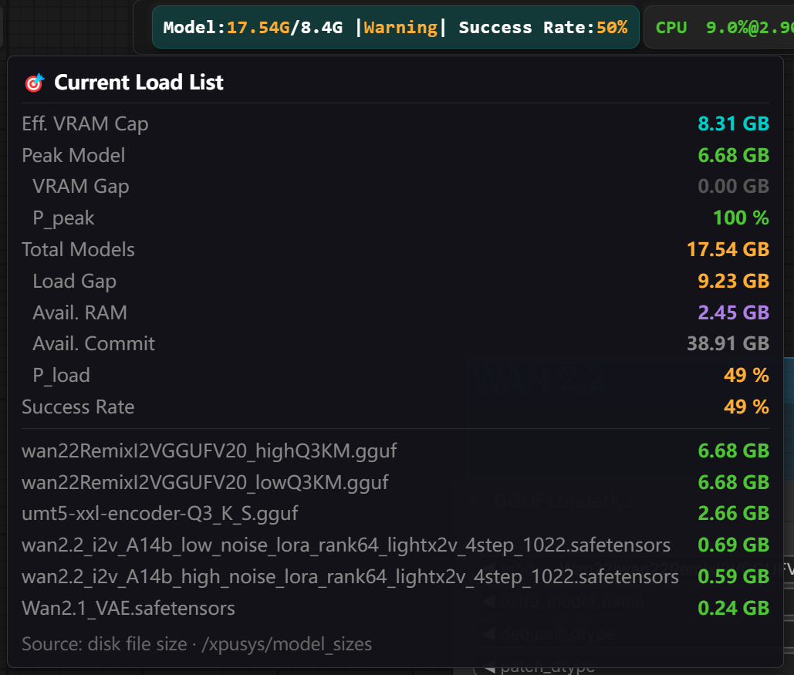
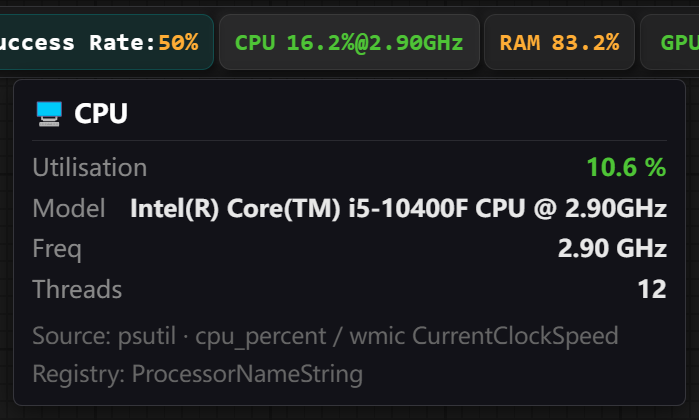
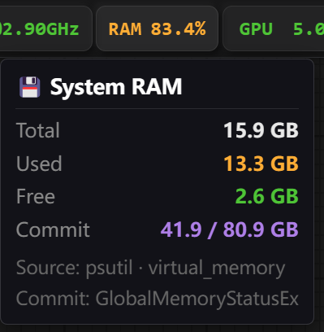
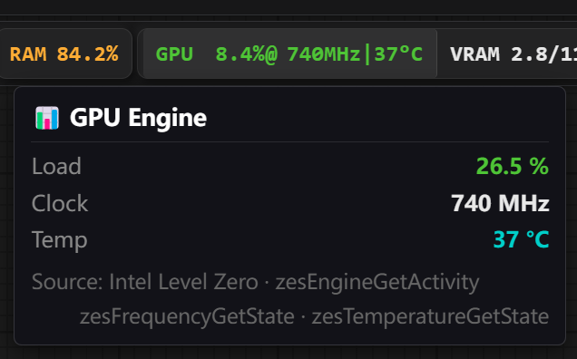
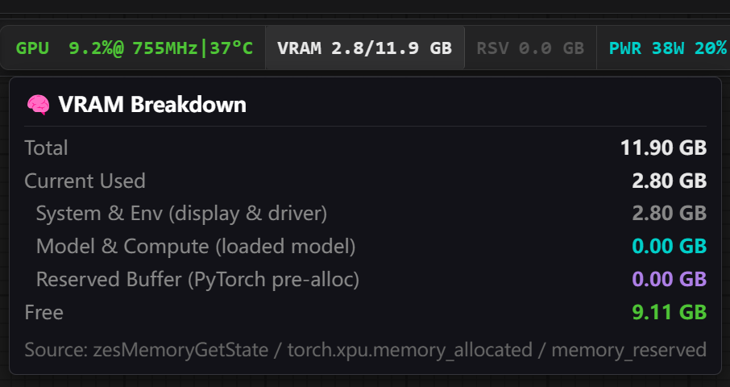
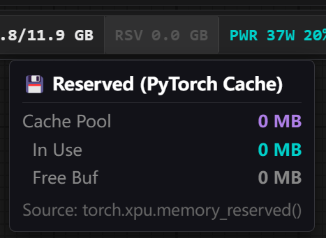
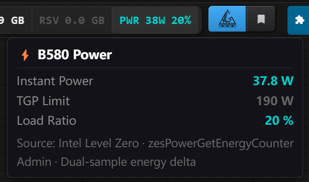

# ComfyUI-XPUSYS-Monitor

> 🌐 **English** | [中文](README_CN.md)

> **Diversity & Coexistence: A Sincere Effort from the "Minority"**
>
> In the ComfyUI ecosystem, Intel Arc (XPU) users may be in the "minority" — but that's exactly why we started. With a scarcity of native XPU monitoring plugins, we set out to build a stable, minimal tool that respects the underlying hardware specs for Intel GPU users.
>
> But we didn't stop there. Through a generalized architecture, this plugin now fully supports NVIDIA (CUDA) and has AMD (ROCm) support in the pipeline.
>
> No matter what GPU you're running, this plugin gives you a clear, at-a-glance view of your system's vitals. Born in the XPU community, open to all platforms — we hope you enjoy it.

---

## Overview

**ComfyUI-XPUSYS-Monitor** is a lightweight ComfyUI hardware monitoring plugin that displays real-time GPU, CPU, and memory metrics as capsules in the top menu bar. It also features an exclusive **Workflow VRAM Predictor** that estimates your run's success rate before you even click Generate.

---

## Features

The status bar contains seven capsules from left to right, split into two groups:

```
[ PRED ]  [ CPU ]  [ RAM ]  |  GPU  |  VRAM  |  RSV  |  PWR  |
 Predict   Processor Memory     └──────── GPU Group ──────────┘
```

> Hover over any capsule to expand its detailed data panel.

---

### 🔮 PRED — Workflow VRAM Predictor

Scans all active model nodes in the current workflow, estimates the VRAM required to run, and gives a success rate estimate before execution.



**Capsule display:**

```
Model Load: 9.80G / 8.2G  |  Status: Warning  |  Predicted Success Rate: 74%
```

| Field | Description |
|-------|-------------|
| `Model Load` | Total disk size of all active models in the workflow |
| Value after `/` | Effective VRAM ceiling = (free VRAM + PyTorch cache) × 0.9 fragmentation discount |
| `Status` | Easy / Safe / Warning / Critical, mapped to green → yellow → red |
| `Success Rate` | Combined probability of hard × soft constraints. See [PRED Deep Dive](#workflow-vram-predictor-pred-deep-dive) |

**Hover panel metrics:**

| Metric | Description |
|--------|-------------|
| VRAM Ceiling | Effective VRAM available for models (after fragmentation discount) |
| Peak Model | Size of the single largest model in the workflow |
| VRAM Gap | Amount by which the peak model exceeds available VRAM (> 0 = OOM risk) |
| VRAM Pressure | Hard constraint probability P_peak |
| Total Model Size | Sum of all active models |
| Load Gap | Amount that total models exceed VRAM, requiring RAM relay |
| Free RAM | True free physical memory reported by OS |
| Free Virtual Memory | Unused portion of Windows commit limit (page file) |
| Load Pressure | Soft constraint probability P_load |
| Success Rate | Final result: P_peak × P_load |
| Model List | All active model filenames sorted by size descending |

---

### 🖥️ CPU — Processor



**Capsule display:**

```
CPU 23.5% @ 4.80GHz
```

| Field | Description |
|-------|-------------|
| `Usage` | Aggregate load across all cores |
| `@ Frequency` | Current real-time clock speed (GHz) |

**Hover panel metrics:**

| Metric | Description |
|--------|-------------|
| Usage | Overall CPU utilization (%) |
| Model | Full processor name (read from registry) |
| Frequency | Real-time clock speed (GHz) |
| Threads | Total logical processor count |

> Data source: `psutil.cpu_percent` / `wmic CurrentClockSpeed` / registry `ProcessorNameString`

---

### 💾 RAM — System Memory



**Capsule display:**

```
RAM 61.3%
```

| Field | Description |
|-------|-------------|
| `Usage` | Current physical memory usage percentage |

**Hover panel metrics:**

| Metric | Description |
|--------|-------------|
| Total | Total physical memory (GB) |
| Used | Currently used amount (GB) |
| Free | True free physical memory (GB) |
| Virtual Memory | Windows committed / commit limit (GB), shown in purple; the "last resort" for PRED predictions |

> Data source: `psutil.virtual_memory` / `GlobalMemoryStatusEx`

---

### 📊 GPU — Engine Status

First capsule in the GPU group. Monitors the GPU compute engine.



**Capsule display:**

```
GPU 87.2% @ 2450MHz | 62°C
```

| Field | Description |
|-------|-------------|
| `Load %` | GPU compute engine utilization |
| `@ Frequency` | Current GPU core clock speed (MHz) |
| `\| Temperature` | GPU core temperature (°C); requires admin on Intel Arc |

**Hover panel metrics:**

| Metric | Description |
|--------|-------------|
| Load | Engine utilization (%) |
| Frequency | Current core clock (MHz) |
| Temperature | Core temperature (°C); red > 85°C, yellow > 70°C |

> Data source (Intel Arc): `zesEngineGetActivity` / `zesFrequencyGetState` / `zesTemperatureGetState`

---

### 🧠 VRAM — Video Memory

Second capsule in the GPU group. Shows driver-level VRAM usage.



**Capsule display:**

```
VRAM 9.8 / 12.0 GB
```

| Field | Description |
|-------|-------------|
| Left value | Driver-reported VRAM currently in use (GB) |
| Right value | Total VRAM capacity (GB) |

**Hover panel metrics:**

| Metric | Description |
|--------|-------------|
| Total | Physical VRAM on the GPU (GB) |
| In Use | Total driver-reported usage |
| 　System & Environment | Fixed overhead: display, driver, OS (gray) — outside ComfyUI's control |
| 　Models & Compute | PyTorch loaded models + live tensors (cyan) |
| 　Reserved Buffer | Pre-allocated PyTorch pool awaiting reuse (purple) |
| Free | Truly available VRAM right now (GB) |

> Data source: `zesMemoryGetState` / `torch.xpu.memory_allocated` / `torch.xpu.memory_reserved`

---

### 🗂️ RSV — PyTorch Cache Pool

Third capsule in the GPU group. Shows PyTorch's total reserved VRAM.



**Capsule display:**

```
RSV 2.1 GB
```

| Field | Description |
|-------|-------------|
| Value | `torch.xpu/cuda.memory_reserved()` in GB |

> RSV ≈ models in use + reserved buffer. When it drops to zero, ComfyUI has fully cleared its cache — VRAM is at its cleanest.

**Hover panel metrics:**

| Metric | Description |
|--------|-------------|
| Cache Total | Total VRAM pool held by PyTorch (MB) |
| 　Active | Currently in-use portion (MB), cyan |
| 　Idle Cache | Allocated but idle, waiting for reuse (MB), gray |

> Data source: `torch.xpu.memory_reserved()`

---

### ⚡ PWR — Power Draw

Fourth capsule in the GPU group. Shows instantaneous GPU power and TGP load ratio.



**Capsule display:**

```
PWR 142W  75%
```

| Field | Description |
|-------|-------------|
| Power | Current instantaneous wattage (dual-sample energy delta) |
| Load ratio | Current power / rated TGP — reflects GPU stress level |

> **Intel Arc users**: Power data requires administrator privileges. Without them, the capsule shows `PWR N/A 🔒`. Click the lock icon for instructions on how to elevate permissions.

**Hover panel metrics:**

| Metric | Description |
|--------|-------------|
| Instant Power | Current frame power draw (W) |
| TGP Limit | Rated TDP for this GPU model (W), from built-in PCI ID table |
| Load Ratio | Power / TGP (%); red > 95%, purple > 80% |

> Data source (Intel Arc): `zesPowerGetEnergyCounter` (requires admin) · dual-sample delta method

---

### 🌐 Platform Support

- **Intel Arc (XPU)** — via Level Zero Sysman; full support for power, frequency, and temperature
- **NVIDIA (CUDA)** — via pynvml; full support
- **AMD (ROCm)** — planned

---

## Workflow VRAM Predictor (PRED) Deep Dive

### What is it predicting?

Before you click Run, the plugin quietly estimates one thing:

> **"Given the current state of this machine, how likely is this workflow to complete without crashing?"**

That probability is what the `PRED` capsule shows. The most common reason AI image generation crashes is simple — **not enough VRAM**. But "not enough" isn't binary: the system can borrow from RAM and virtual memory to compensate, so success probability is a continuous value, not a yes/no.

### Core Insight: Models Don't Need to Be in VRAM Simultaneously

ComfyUI workflows run **serially** — CLIP encoding, diffusion sampling, VAE decoding each load, run, and unload one at a time.  
So the real rules for "can this run?" come down to just two constraints:

1. **Can the largest single model fit in VRAM?** (Hard constraint — determines survival)
2. **Can all models relay through RAM?** (Soft constraint — determines stability)

### How Each Constraint Affects Success Rate

**Hard Constraint — Peak Model vs Available VRAM**

```
Available VRAM = (Free VRAM + PyTorch Cache) × 0.9
```

The `0.9` discount accounts for VRAM fragmentation. The more overflow, the steeper the drop:

| Overflow | Reference Success Rate |
|----------|----------------------|
| 0% (just fits) | 100% |
| 10% | ~74% |
| 30% | ~41% |
| 50% | ~22% |
| 100% | ~5% |

**Soft Constraint — Total Model Size vs RAM / Virtual Memory**

| Scenario | Success Rate Range |
|----------|--------------------|
| All models fit in VRAM | 100% |
| Exceeds VRAM, but free RAM can relay | 70%–100% |
| RAM also insufficient, needs virtual memory (disk paging) | 5%–70% |
| Even virtual memory is exhausted | ~0% |

**Final Success Rate = Hard Constraint Rate × Soft Constraint Rate**

> Key takeaway: If the largest model can't fit in VRAM, overall success rate will be severely dragged down regardless of how much RAM you have.

### Color Signals and Recommended Actions

| PRED Display | Meaning | Recommendation |
|-------------|---------|----------------|
| 🟢 ≥ 80% | Safe | Run freely |
| 🟡 40%–80% | Warning | Close memory-heavy apps, or reduce model precision |
| 🔴 < 40% | Danger | Reduce model count in workflow, or switch to smaller models |

### Practical Tips to Reduce Memory Pressure

- Replace FP16 models with **quantized models** (GGUF Q4/Q8) — cuts VRAM usage by 50–75%
- Set unused nodes to **bypass** — the predictor automatically excludes them
- Close browsers, games, and other memory-heavy apps before running
- After an OOM crash, **restart ComfyUI** to clear VRAM fragmentation — the same workflow may succeed afterward
- If using multiple LoRAs, consider merging them into a single file in advance

> **Note**: The algorithm estimates VRAM usage from model disk file sizes. For quantized models (GGUF), actual VRAM usage is much lower than the estimate — so the true success rate will be higher than displayed. This is intentional conservative estimation; the bias direction is safe for users.

---

## Installation

### Option 1: ComfyUI Manager (Recommended)
Search for `XPUSYS Monitor` in ComfyUI Manager and install with one click.

### Option 2: Manual Installation
```bash
cd ComfyUI/custom_nodes
git clone https://github.com/allanmeng/ComfyUI-XPUSYS-Monitor
cd ComfyUI-XPUSYS-Monitor
pip install -r requirements.txt
```

---

## Dependencies

| Package | Purpose |
|---------|---------|
| `psutil` | CPU / memory monitoring (required) |
| `pynvml` | NVIDIA GPU monitoring (optional for non-NVIDIA setups) |

> **Note**: `torch` and `aiohttp` are provided by ComfyUI itself — no separate installation needed.

---

## Permissions (Intel Arc Users — Important)

Intel Arc (XPU) uses **Level Zero Sysman** as its backend. On Windows, Sysman requires administrator privileges to read power, temperature, and other hardware data.  
**All Intel Arc users are strongly recommended to launch ComfyUI as Administrator**, otherwise the following features will be unavailable:

| Feature | Normal | Admin |
|---------|--------|-------|
| GPU Load / Frequency | ✅ | ✅ |
| Temperature | ❌ | ✅ |
| Power (PWR) | ❌ | ✅ |
| VRAM Predictor (PRED) | ✅ | ✅ |
| CPU / RAM Monitoring | ✅ | ✅ |

> NVIDIA / AMD users are not affected — full data is available without elevated privileges.

### Two Ways to Run as Administrator

#### Option 1: Right-Click (Quick & Temporary)

1. Locate your ComfyUI launch script (e.g. `run_nvidia_gpu.bat` or `Stable_Start_IntelARC.bat`)
2. **Right-click** → select **"Run as administrator"**
3. Click **"Yes"** in the UAC prompt

> This requires manual action every time. Best for occasional use or testing.

#### Option 2: Embed Auto-Elevation in Your Launch Script (Recommended)

Add the following block to the **very top** of your `.bat` script. It detects non-admin context, closes the current window, and relaunches itself elevated automatically:

```bat
:check_admin
net session >nul 2>&1
if %errorLevel% == 0 (
    goto :admin_start
) else (
    echo [Permission Check] Requesting administrator privileges...
    powershell -Command "Start-Process '%~f0' -Verb RunAs"
    exit
)

:admin_start
cd /d "%~dp0"
echo [OK] Privileges elevated. Starting ComfyUI...
```

**Usage notes:**
- Paste this block after `@echo off` at the top of your `.bat` file
- Put your original launch logic after `:admin_start`
- The first run will show a UAC prompt — click "Yes". The elevated window then continues automatically.

**Full example structure:**

```bat
@echo off
chcp 65001 >nul

:check_admin
net session >nul 2>&1
if %errorLevel% == 0 (
    goto :admin_start
) else (
    echo [Permission Check] Requesting administrator privileges...
    powershell -Command "Start-Process '%~f0' -Verb RunAs"
    exit
)

:admin_start
cd /d "%~dp0"
echo [OK] Privileges elevated. Starting ComfyUI...

:: ↓ Add your original launch commands below ↓
:: e.g.: call conda activate comfyui
:: e.g.: python main.py --listen 0.0.0.0
```

---

## Settings

Adjustable in the **XPUSYS_Mon** section of ComfyUI's settings page:

- **Refresh Interval**: Data update frequency (200–5000 ms, default 1000 ms)
- **Font Size**: Status bar text size (12–22 px, default 16 px)
- **Language**: Chinese / English / Follow System
- Per-capsule **show / hide** toggles

---

## System Requirements

- ComfyUI (any recent version)
- Python 3.10+
- PyTorch 2.5+ (XPU build required for Intel Arc)
- Windows (primary test environment); Linux theoretically compatible — feedback welcome

---

## License

[MIT License](LICENSE)

---

## Acknowledgements

Thanks to everyone who helped this project go further:

- **Intel Arc users** — You are the original motivation behind this project. As the "minority", your persistence and feedback showed us it was worth continuing.
- **NVIDIA users** — Thanks for helping validate CUDA path compatibility and keeping the plugin from being XPU-only.
- **AMD users** — Thanks for your interest and patience. ROCm support is in progress.
- **Beta testers** — Thanks for investing your time in early versions: testing, filing issues, and suggesting improvements. The stability we have today wouldn't exist without you.
