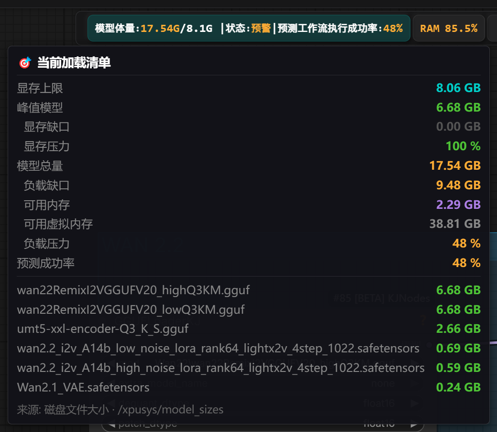
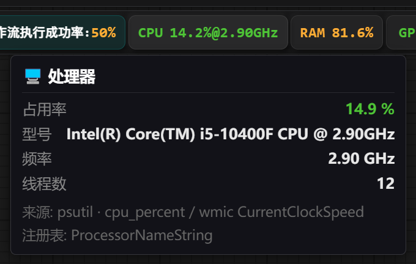
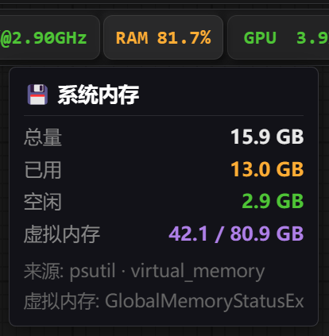
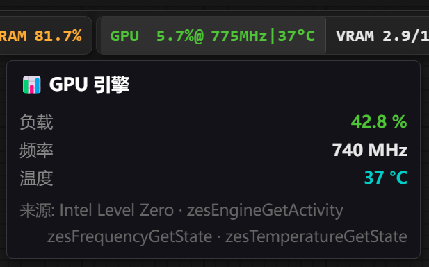
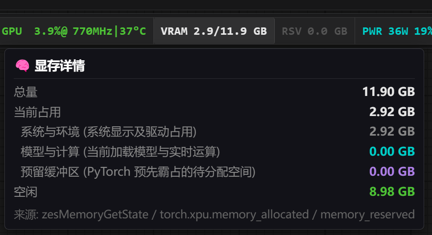
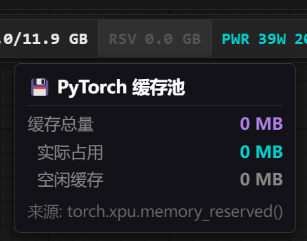
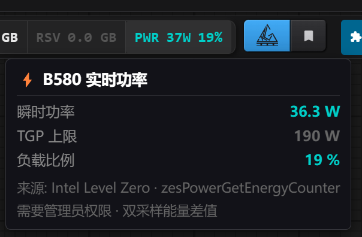

# ComfyUI-XPUSYS-Monitor

> 🌐 [English](README.md) | **中文**

> **多元与共生：一份来自"少数派"的诚意**
>
> 在 ComfyUI 的生态中，Intel Arc (XPU) 用户或许是"少数派"，但这正是我们出发的理由。由于原生 XPU 监控插件的稀缺，我们立足当下，旨在为 Intel 显卡用户提供符合底层规范、稳定且极简的工具支持。
>
> 但我们并未止步于此——通过架构的通用化设计，这款插件已兼容 NVIDIA (CUDA) 平台并计划 AMD (ROCm) 平台的适配。
>
> 无论你手持哪种硬件，都能通过它一眼洞悉系统脉搏。这是一款诞生于 XPU 社区、并向全平台开发者开放的工具，希望你喜欢。

---

## 简介

**ComfyUI-XPUSYS-Monitor** 是一款以 Intel Arc 为核心的 ComfyUI 硬件监控插件，在顶部菜单栏以胶囊形式实时展示 GPU、CPU、内存等关键指标，并提供独家的**工作流执行成功率预测**功能，让你在点击运行前就能预判本次工作流能否顺利完成。同时完整支持 NVIDIA (CUDA) 平台。

---

## 功能特性

状态栏从左到右共有六个胶囊，分为两组：

```
[ PRED ]  [ CPU ]  [ RAM ]  |  GPU  |  VRAM  |  RSV  |  PWR  |
  预测      处理器   内存        └────────── GPU 综合组 ──────────┘
```

> 鼠标悬停在任意胶囊上可展开详细数据面板。

---

### 🔮 PRED — 工作流显存预测

扫描当前工作流中所有活跃的模型节点，预测运行所需显存，在运行前给出成功率评估。



**胶囊显示：**

```
模型体量: 9.80G / 8.2G  |  状态: 预警  |  预测工作流执行成功率: 74%
```

| 字段 | 说明 |
|------|------|
| `模型体量` | 当前工作流所有活跃模型的磁盘文件大小总量 |
| `/` 后的数值 | 可用显存上限（空闲显存 + PyTorch 缓存）× 0.9 碎片折扣 |
| `状态` | 轻松 / 安全 / 预警 / 危险，对应绿→黄→红颜色 |
| `预测成功率` | 硬约束 × 软约束的综合概率，详见 [PRED 详解](#工作流显存预测pred详解) |

**悬停面板指标：**

| 指标 | 说明 |
|------|------|
| 显存上限 | 实际可分配给模型的有效显存（已扣碎片折扣） |
| 峰值模型 | 工作流中单个最大模型的文件大小 |
| 显存缺口 | 峰值模型超出有效显存的量（> 0 时有 OOM 风险） |
| 显存压力 | 硬约束分项概率 P_peak |
| 模型总量 | 所有活跃模型的总大小 |
| 负载缺口 | 模型总量超出显存后需要内存中转的量 |
| 可用内存 | OS 当前真实空闲物理内存 |
| 可用虚拟内存 | Windows 提交限制中尚未使用的部分（分页文件） |
| 负载压力 | 软约束分项概率 P_load |
| 预测成功率 | P_peak × P_load 最终结果 |
| 模型列表 | 按大小降序列出工作流中所有活跃模型文件名及大小 |

---

### 🖥️ CPU — 处理器




**胶囊显示：**

```
CPU 23.5% @ 4.80GHz
```

| 字段 | 说明 |
|------|------|
| `占用率` | 所有核心的综合负载百分比 |
| `@ 频率` | 当前实时主频（GHz） |

**悬停面板指标：**

| 指标 | 说明 |
|------|------|
| 占用率 | CPU 综合使用率（%） |
| 型号 | 处理器完整型号名称（注册表读取） |
| 频率 | 实时主频（GHz） |
| 线程数 | 逻辑处理器总数 |

> 数据来源：`psutil.cpu_percent` / `wmic CurrentClockSpeed` / 注册表 `ProcessorNameString`

---

### 💾 RAM — 系统内存



**胶囊显示：**

```
RAM 61.3%
```

| 字段 | 说明 |
|------|------|
| `占用率` | 物理内存当前使用百分比 |

**悬停面板指标：**

| 指标 | 说明 |
|------|------|
| 总量 | 物理内存总量（GB） |
| 已用 | 当前已使用量（GB） |
| 空闲 | 当前真实空闲量（GB） |
| 虚拟内存 | Windows 已提交 / 提交上限（GB），紫色标注；PRED 预测的"最后防线" |

> 数据来源：`psutil.virtual_memory` / `GlobalMemoryStatusEx`

---

### 📊 GPU — 引擎状态

GPU 综合组的第一格，监控 GPU 计算核心的运行状态。




**胶囊显示：**

```
GPU 87.2% @ 2450MHz | 62°C
```

| 字段 | 说明 |
|------|------|
| `负载 %` | GPU 计算引擎占用率 |
| `@ 频率` | GPU 核心当前运行频率（MHz） |
| `\| 温度` | GPU 核心温度（°C），需管理员权限（Intel Arc） |

**悬停面板指标：**

| 指标 | 说明 |
|------|------|
| 负载 | 引擎使用率（%） |
| 频率 | 当前核心频率（MHz） |
| 温度 | 核心温度（°C），> 85°C 红色，> 70°C 黄色 |

> 数据来源（Intel Arc）：`zesEngineGetActivity` / `zesFrequencyGetState` / `zesTemperatureGetState`

---

### 🧠 VRAM — 显存占用

GPU 综合组的第二格，展示驱动层面的显存使用情况。



**胶囊显示：**

```
VRAM 9.8 / 12.0 GB
```

| 字段 | 说明 |
|------|------|
| 左侧数值 | 驱动层当前已占用显存（GB） |
| 右侧数值 | 显卡总显存容量（GB） |

**悬停面板指标：**

| 指标 | 说明 |
|------|------|
| 总量 | 显卡物理显存（GB） |
| 当前占用 | 驱动报告的已占用总量 |
| 　系统与环境 | 系统显示、驱动等固定开销（灰色），ComfyUI 无法控制 |
| 　模型与计算 | PyTorch 当前加载的模型 + 实时张量（青色） |
| 　预留缓冲区 | PyTorch 预先霸占的待分配空间（紫色），下次分配时优先复用 |
| 空闲 | 当前真正可用的空闲显存（GB） |

> 数据来源：`zesMemoryGetState` / `torch.xpu.memory_allocated` / `torch.xpu.memory_reserved`

---

### 🗂️ RSV — PyTorch 缓存池

GPU 综合组的第三格，单独展示 PyTorch 的显存预留总量。



**胶囊显示：**

```
RSV 2.1 GB
```

| 字段 | 说明 |
|------|------|
| 数值 | `torch.xpu/cuda.memory_reserved()` 的值（GB） |

> RSV ≈ 模型占用 + 预留缓冲区之和。归零说明 ComfyUI 已清空缓存，此时显存最为"干净"。

**悬停面板指标：**

| 指标 | 说明 |
|------|------|
| 缓存总量 | PyTorch 持有的显存池总大小（MB） |
| 　实际占用 | 当前正在使用的部分（MB），青色 |
| 　空闲缓存 | 已申请但暂时闲置、等待复用的部分（MB），灰色 |

> 数据来源：`torch.xpu.memory_reserved()`

---

### ⚡ PWR — 实时功耗

GPU 综合组的第四格，展示 GPU 瞬时功耗及 TGP 负载比例。



**胶囊显示：**

```
PWR 142W  75%
```

| 字段 | 说明 |
|------|------|
| 功耗 | 当前瞬时功耗（W），双采样能量差值计算 |
| 负载比例 | 当前功耗 / 规格 TGP，反映 GPU 压力程度 |

> **Intel Arc 用户注意**：功耗数据需要管理员权限。普通模式下胶囊显示 `PWR N/A 🔒`，点击锁图标可查看提升权限的说明。

**悬停面板指标：**

| 指标 | 说明 |
|------|------|
| 瞬时功率 | 当前帧功耗（W） |
| TGP 上限 | 该型号的规格设计功耗（W），来自内置 PCI ID 表 |
| 负载比例 | 功耗 / TGP（%），> 95% 红色，> 80% 紫色 |

> 数据来源（Intel Arc）：`zesPowerGetEnergyCounter`（需管理员）· 双采样差值法

---

### 🌐 跨平台支持

- **Intel Arc (XPU)** — 基于 Level Zero Sysman，完整支持功耗、频率、温度监控
- **NVIDIA (CUDA)** — 基于 pynvml，完整支持
- **AMD (ROCm)** — 计划中

---

## 工作流显存预测（PRED）详解

### 它在预测什么？

在你点击运行之前，插件会悄悄估算一件事：

> **"以当前机器的状态，这个工作流大概有多大概率能跑完，而不是中途崩溃？"**

这个概率就是状态栏 `PRED` 胶囊显示的数值。跑 AI 图像生成最常见的崩溃原因只有一个——**显存（VRAM）不够用**。但"不够用"并不是非黑即白，系统还可以借用内存、虚拟内存来凑，所以成功率是一个连续的概率，而不是简单的"能/不能"。

### 核心洞察：模型不需要同时在显存里

ComfyUI 工作流是**串行**执行的——CLIP 编码、扩散采样、VAE 解码，一个用完就卸载，下一个再加载。  
因此，判断"能不能跑"的真正规则只有两条：

1. **最大的单个模型能否装入显存**（硬约束，决定生死）
2. **所有模型总量能否在内存中循环中转**（软约束，决定稳定性）

### 两个约束如何影响成功率

**硬约束 — 最大模型 vs 可用显存**

```
可用显存 = （空闲显存 + PyTorch 缓存）× 0.9
```

乘以 `0.9` 是对显存碎片化损耗的折扣。溢出越多，成功率下降越陡：

| 溢出比例 | 参考成功率 |
|---------|-----------|
| 0%（刚好装入） | 100% |
| 10% | ~74% |
| 30% | ~41% |
| 50% | ~22% |
| 100% | ~5% |

**软约束 — 总量 vs 内存 / 虚拟内存**

| 情况 | 成功率区间 |
|------|-----------|
| 全部模型可常驻显存 | 100% |
| 超出显存，但空闲内存够中转 | 70%～100% |
| 内存也不够，需要虚拟内存（硬盘分页） | 5%～70% |
| 连虚拟内存都不够 | ~0% |

**最终成功率 = 硬约束成功率 × 软约束成功率**

> 关键结论：只要最大模型装不进显存，无论内存多大，整体成功率都会被大幅拉低。

### 颜色信号与建议操作

| PRED 显示 | 含义 | 建议 |
|-----------|------|------|
| 🟢 ≥ 80% | 安全 | 直接运行 |
| 🟡 40%～80% | 预警 | 关闭大内存程序，或降低模型精度 |
| 🔴 < 40% | 危险 | 减少工作流模型数量，或换更小的模型 |

### 降低内存压力的实用技巧

- 用**量化模型**（GGUF Q4/Q8）替代 FP16，显存占用可减少 50%～75%
- 将工作流中暂时不用的节点设为 **bypass**（算法自动排除，不计入预测）
- 运行前关闭浏览器、游戏等大内存程序
- 遇到 OOM 后**重启 ComfyUI** 可清理显存碎片，有时能让同一工作流跑通
- 如果使用多个 LoRA，考虑提前合并成单个文件

> **注意**：算法使用模型的磁盘文件大小估算显存占用。对于量化模型（GGUF），实际占用远小于估算值，真实成功率会比显示的高——这是有意为之的保守估计，偏差方向对用户安全。

📖 **想了解完整的算法逻辑？** → [预测器通俗解读（中文）](docs/predictor_explained_CN.md)

---

## 安装

### 方式一：ComfyUI Manager（推荐）
在 ComfyUI Manager 中搜索 `XPUSYS Monitor` 一键安装。

### 方式二：手动安装
```bash
cd ComfyUI/custom_nodes
git clone https://github.com/allanmeng/ComfyUI-XPUSYS-Monitor
cd ComfyUI-XPUSYS-Monitor
pip install -r requirements.txt
```

---

## 依赖

| 包 | 用途 |
|----|------|
| `psutil` | CPU / 内存监控（必须） |
| `pynvml` | NVIDIA GPU 监控（非 NVIDIA 环境可忽略） |

> **注意**：`torch` 和 `aiohttp` 由 ComfyUI 自身提供，无需单独安装。

---

## 权限说明（Intel Arc 用户必读）

Intel Arc (XPU) 的底层接口 **Level Zero Sysman** 在 Windows 上需要管理员权限才能读取功耗、温度等 Sysman 数据。  
**建议所有 Intel Arc 用户以管理员身份启动 ComfyUI**，否则以下功能将不可用：

| 功能 | 普通权限 | 管理员权限 |
|------|---------|-----------|
| GPU 负载 / 频率 | ✅ | ✅ |
| 温度监控 | ❌ | ✅ |
| 功耗监控（PWR） | ❌ | ✅ |
| 显存预测（PRED） | ✅ | ✅ |
| CPU / RAM 监控 | ✅ | ✅ |

> NVIDIA / AMD 用户无此限制，以普通权限运行即可获得完整数据。

### 获取管理员权限的两种方式

#### 方式一：鼠标右键启动（临时使用）

1. 找到你的 ComfyUI 启动脚本（如 `run_nvidia_gpu.bat` 或 `Stable_Start_IntelARC.bat`）
2. **右键点击** → 选择 **"以管理员身份运行"**
3. 在弹出的 UAC 确认窗口中点击 **"是"**

> 此方式每次启动都需要手动操作，适合偶尔使用或测试场景。

#### 方式二：启动脚本内嵌权限自动提升（推荐）

在你的 `.bat` 启动脚本**最顶部**加入以下代码块，脚本将在检测到非管理员权限时，**自动关闭当前窗口并以管理员身份重新启动**，无需每次手动右键：

```bat
:check_admin
net session >nul 2>&1
if %errorLevel% == 0 (
    goto :admin_start
) else (
    echo [权限检查] 正在请求管理员权限并关闭当前窗口...
    :: 启动新窗口（管理员）
    powershell -Command "Start-Process '%~f0' -Verb RunAs"
    :: 强制关闭当前的非管理员窗口
    exit
)

:admin_start
:: 只有管理员窗口能看到这里
cd /d "%~dp0"
echo [成功] 权限已提升，开始配置运行环境...
```

**使用说明：**
- 将上述代码块粘贴到 `.bat` 文件的第一行（`@echo off` 之后）
- `:admin_start` 标签之后接原本的启动逻辑（如激活 conda 环境、设置环境变量、启动 `main.py` 等）
- 首次运行会弹出 UAC 窗口，点击"是"即可；之后权限提升后的窗口将**自动继续执行**，无需额外操作

**完整示例结构：**

```bat
@echo off
chcp 65001 >nul

:check_admin
net session >nul 2>&1
if %errorLevel% == 0 (
    goto :admin_start
) else (
    echo [权限检查] 正在请求管理员权限...
    powershell -Command "Start-Process '%~f0' -Verb RunAs"
    exit
)

:admin_start
cd /d "%~dp0"
echo [成功] 权限已提升，开始启动 ComfyUI...

:: ↓ 在此处添加你原有的启动命令 ↓
:: 例如：call conda activate comfyui
:: 例如：python main.py --listen 0.0.0.0
```

---

## 设置项

在 ComfyUI 设置页的 **XPUSYS_Mon** 分组中可调整：

- **刷新间隔**：数据更新频率（200–5000 ms，默认 1000 ms）
- **字体大小**：状态栏字号（12–22 px，默认 16 px）
- **界面语言**：中文 / English / 跟随系统
- 各胶囊的**显示 / 隐藏**开关

---

## 系统要求

- ComfyUI（任意最新版本）
- Python 3.10+
- PyTorch 2.5+（Intel XPU 需使用 XPU 版构建）
- Windows（当前主要测试环境）；Linux 理论兼容，欢迎反馈

---

## 许可证

[MIT License](LICENSE)

---

## 致谢

感谢以下朋友让这个项目走得更远：

- **Intel Arc 用户们** — 你们是这个项目最初的动力来源。作为"少数派"，你们的坚持和反馈让我们看到了继续做下去的价值。
- **NVIDIA 用户们** — 感谢协助验证 CUDA 路径的兼容性，让插件不止步于 XPU 生态。
- **AMD 用户们** — 感谢关注与期待，ROCm 支持正在推进中，你们的耐心是最大的鼓励。
- **参与内测的朋友们** — 感谢你们在早期版本中投入时间反复测试、提交问题、给出改进建议，没有你们就没有现在的稳定性。


